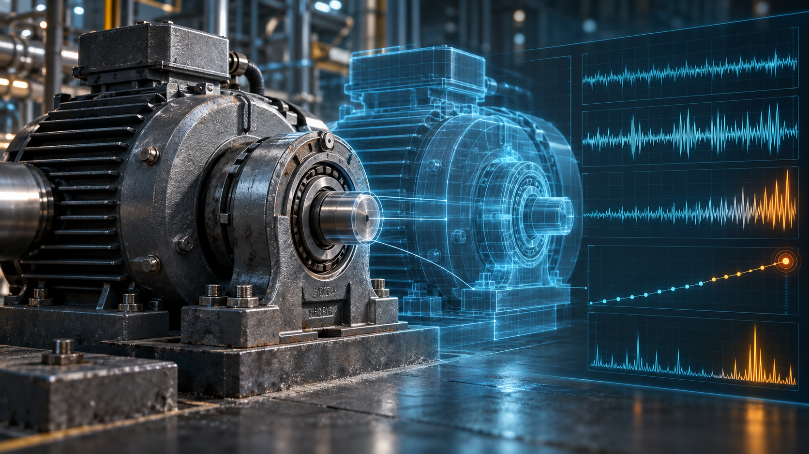

# AI-Powered Predictive Analytics in Digital Twins

Author: concierge@massivequbit.io

> Editorial draft awaiting approval. Author: concierge@massivequbit.io. This is new article text expanding a previously published summary; the revision date will be recorded when approved.

A prediction becomes useful when someone can act on it. In a digital twin, a model might flag unusual behaviour, estimate a future measurement, or help prioritise maintenance. These are different tasks with different evidence requirements. Calling every output “predictive maintenance” can hide those differences.

NIST's AI Risk Management Framework provides a voluntary framework for managing risks in the design, development, use, and evaluation of AI systems. It is a useful governance reference, but it does not certify a particular maintenance model or establish its accuracy. [NIST AI Risk Management Framework](https://www.nist.gov/itl/ai-risk-management-framework)

The workflow below is our proposed approach to a maintenance pilot. Its examples are hypothetical and make no claim about results achieved by MassiveQubit or its customers.

## Research basis

Carvalho and colleagues review machine-learning methods applied to predictive maintenance. That literature establishes a research basis for considering multiple approaches; it does not establish the accuracy of a model on a new asset fleet. The pilot below therefore requires local data evaluation and comparison against an explicit baseline. [Carvalho et al., 2019](https://doi.org/10.1016/j.cie.2019.106024)

## Define the action before selecting a model

Suppose a maintenance team can inspect a pump during the next planned stop. A useful prediction might identify pumps needing inspection with enough notice to schedule the work. A model that detects a problem seconds before a stoppage may be accurate yet offer little scheduling value.

Write down the prediction horizon, available response, and cost of a false alarm. Decide what the model is allowed to recommend and who accepts the recommendation. Keep anomaly detection distinct from diagnosis: unusual vibration alone does not establish a particular mechanical fault.

Start with a baseline that the team understands, such as a threshold adjusted for operating state. A complex model should demonstrate improvement over that baseline under the same evaluation conditions.

## Build a dataset that matches the decision

Join measurements to maintenance records using stable asset identifiers and explicit time boundaries. Investigate whether a work order records failure, inspection, planned replacement, or an administrative event. Those labels should not be treated as equivalent outcomes.

List which inputs would actually exist when a prediction is made. Exclude information entered after the outcome, such as a diagnosis added to a completed work order. Otherwise, evaluation may reward the model for information unavailable during operation.

Split evaluation data according to the intended deployment. A future-time test helps examine performance after training; holding out assets helps assess whether the model transfers to equipment it has not seen. Randomly mixing neighbouring windows from the same operating episode can make a test easier than the real task.

## Measure useful warnings

Report event-level performance and warning lead time, not just a single accuracy score. Include false alerts per asset over a defined period, missed target events, and the proportion of warnings that arrived early enough for the planned response.

Inspect performance across operating modes and asset groups. If the evaluation contains few failures, state that limitation and show the actual counts. A percentage computed from a handful of events should not be presented as a dependable fleet-wide estimate.

Choose the alert threshold with the maintenance team. The same prediction score may justify inspection for one asset and observation for another because inspection cost, redundancy, and production consequences differ.

## Connect predictions to the twin responsibly

Store the prediction timestamp, model version, input freshness, and relevant operating context beside the output. Mark stale or unsupported predictions clearly. When the input lies outside the validated conditions, the system should be able to withhold advice rather than force a result.

Run initially in shadow mode: record predictions while the existing maintenance process remains in charge. Compare proposed actions with actual inspections and outcomes. Ask why operators would reject a recommendation; the explanation may reveal an unmodelled constraint.

Monitor the deployed workflow as well as the model. Track whether alerts are acknowledged, whether inspections happen, and whether the resulting evidence reaches the evaluation dataset. Log model updates so performance changes can be traced to a specific version.

## Make continued use conditional on evidence

Set a review interval and define withdrawal conditions before rollout. Missing inputs, a new equipment configuration, or a changed maintenance policy may require reevaluation. Keep the previous operating method available while that review happens.

The desired outcome is a repeatable maintenance decision with measurable value. The twin provides context; the model provides an estimate; the operating team supplies the action and feedback needed to judge whether the estimate helps.

## References

### Academic and research publications

1. Carvalho, T. P., et al. (2019). A systematic literature review of machine learning methods applied to predictive maintenance. *Computers & Industrial Engineering*, 137, 106024. [DOI: 10.1016/j.cie.2019.106024](https://doi.org/10.1016/j.cie.2019.106024).

### Technical and institutional sources

1. [NIST AI Risk Management Framework](https://www.nist.gov/itl/ai-risk-management-framework). Accessed 2026-09-13.
