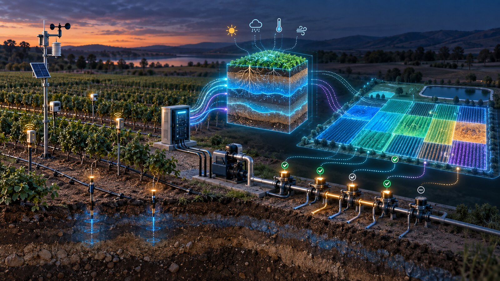

# Closed-Loop Irrigation Digital Twins: From Soil Sensors to Guarded Valve Commands

Author: concierge@massivequbit.io

An irrigation dashboard reports what sensors measured. A useful digital twin goes further: it maintains an explicit estimate of water stored in each crop root zone, predicts how weather and irrigation will change that state, compares alternative schedules, and returns only commands that satisfy operational limits. This article presents a practical architecture for that loop. It combines IoT observations, an agronomic water-balance model, interoperable data interfaces, and guarded automation. The approach is feasible for a staged pilot, but field calibration and fail-safe control matter more than algorithmic sophistication.

## The practical problem: incomplete observations

Soil-moisture probes measure a small volume of heterogeneous soil. A single reading cannot represent an entire irrigation block, and the same volumetric water content can imply different plant-available water in sand and clay. Weather forecasts add uncertainty; emitters clog; pressure varies; and a valve command does not prove that water reached the field.

Digital twins can organize these partial observations around a state model rather than treating every sensor threshold independently. Alves, Maia, and Lima presented a smart-farming irrigation twin in which physical sensors and actuators were connected to virtual representations, demonstrating a concrete bidirectional architecture while describing agricultural twins as an early-stage field [1]. Manocha, Sood, and Bhatia subsequently proposed an IoT–digital-twin irrigation approach focused on water utilization [2]. These peer-reviewed studies establish technical plausibility, not universal water savings: results depend on crop, soil, climate, instrumentation, control policy, and evaluation design.

## A minimum credible twin

The smallest useful unit is an irrigation management zone, not an individual sensor. Each zone should have a stable identifier, crop and growth stage, effective root depth, soil hydraulic parameters, irrigation hardware, allowable operating window, and links to observations.

The observation layer should ingest:

- soil moisture at two or more representative depths;
- rainfall, air temperature, humidity, wind speed, and solar radiation or a trusted weather feed;
- irrigation flow, upstream and downstream pressure, valve state, and pump status;
- optional electrical energy, salinity, canopy temperature, or remote-sensing products.

The Open Geospatial Consortium's SensorThings API defines a geospatially enabled model and REST interfaces for heterogeneous IoT observations; Part 1 covers sensing and Part 2 covers tasking [3]. Using its entities—or an equivalent versioned internal model—helps keep sensors, observed properties, locations, and datastreams separate. It does not remove the need to calibrate probes or secure field gateways.

The state layer maintains a daily or sub-daily root-zone water balance. A simplified form is:

`storage(t+1) = storage(t) + effective rainfall + applied irrigation − crop evapotranspiration − drainage − runoff`.

FAO Irrigation and Drainage Paper 56 defines reference evapotranspiration from weather data and relates crop water demand to crop coefficients and development stage [4]. The twin can use that physics-based calculation as a baseline, then assimilate soil-moisture observations to correct drift. Machine learning may estimate hard-to-measure terms or forecast demand, but it should not silently replace the water balance until it has been validated across seasons.

## A guarded decision loop

The decision service runs candidate schedules through the zone model. Its objective might minimize predicted crop water stress, pumping energy, and excessive drainage subject to limits on allocation, pump capacity, valve combinations, application depth, and permitted hours.

Separate recommendation from execution. A recommendation includes the zone, proposed start time, duration or volume, expected state change, confidence, model version, and evidence timestamps. A command gateway then checks an independent allowlist and hard constraints. It rejects stale observations, implausible flows, conflicting valve states, communications loss, and commands outside configured limits.

Execution must be verified. After opening a valve, the controller should require a corresponding pressure and flow response within a defined interval. Excess flow may indicate a leak; low flow may indicate blockage or pump failure. Either condition should close the affected path or return control to the existing irrigation controller according to a site-specific safe state. The digital twin must never infer successful irrigation from a software acknowledgement alone.

## Hypothetical 20-hectare pilot

Consider a hypothetical 20-hectare vineyard divided into eight hydraulic zones. The pilot begins in advisory mode for one block. Install three representative probe stations, each measuring two depths, and integrate an on-site weather station. Add a flow meter and pressure sensor at the block inlet; use existing valve feedback where available.

For four weeks, collect data without changing schedules. Reconcile sensor values with manual soil checks, irrigation logs, rainfall, and observed equipment behaviour. Estimate field capacity and the lower management threshold for the chosen soil and root depth. Configure the FAO-56 baseline with locally appropriate crop coefficients and document every adjustment.

Next, replay the period through the twin and compare its recommended irrigation with actual practice. Useful acceptance measures include missing-data rate, water-balance closure, prediction error at each probe depth, false leak alarms, recommendation stability, and irrigation volume per zone. Do not claim crop or water benefits from replay alone.

Run two further stages: live recommendations requiring human approval, then guarded automatic operation on one low-risk zone. Expand only after the team has tested communications loss, stuck valves, zero and excess flow, sensor drift, rainfall during irrigation, model restart, clock error, and manual override.

## Feasibility, resources, and indicative cost

Field hardware may include capacitance or tensiometric probes, a weather station, flow and pressure instrumentation, valve feedback, a low-power gateway, solar supply, and LoRaWAN, cellular, or farm Wi-Fi connectivity. Software needs time-series storage, a zone registry, SensorThings-compatible or equivalent APIs, water-balance and forecasting services, a command gateway, alerting, audit logs, and versioned configuration.

Skills span irrigation agronomy, soil science, instrumentation, low-power networking, hydraulic commissioning, data engineering, control safety, and cybersecurity. The pilot team must include someone who can distinguish a model error from a field installation problem.

The following calculation is hypothetical, not a quotation. Assume AUD 12,000 for probes, weather, flow, pressure, gateway, power, and installation; 18 engineering days for integration and the twin; 8 agronomy and calibration days; and 4 commissioning days. At an illustrative loaded rate of AUD 1,400 per day, professional work is `30 × 1,400 = AUD 42,000`. Adding hardware gives an indicative total of `42,000 + 12,000 = AUD 54,000`. Existing telemetry can reduce cost; trenching, cellular service, new valves, pump controls, remote sensing, and seasonal trials can increase it materially.

## Limitations, cybersecurity, and privacy

Spatial variability is the primary technical limitation. More sensors reduce blind spots but increase maintenance and do not automatically make a zone uniform. Crop coefficients and effective root depth change with growth stage. Forecast error and rainfall distribution can dominate a precise calculation. Report uncertainty and keep conservative operating margins.

Field devices are exposed to weather, animals, theft, power interruption, and intermittent networks. Use unique device identities, encrypted transport where supported, signed firmware, restricted outbound connections, protected local storage, and an inventory of versions and ownership. Segment the command gateway from general farm IT. Log every recommendation, approval, command, acknowledgement, and measured hydraulic response. Recovery must work without cloud connectivity.

Farm data can reveal production practices, water allocations, yield proxies, and commercial timing. Collect only data required by the pilot, define retention and export rights, separate agronomic records from personal information, and restrict map and actuator access by role. Third-party weather, satellite, and analytics services require contractual review of data ownership and reuse.

## Actionable conclusion

Build an irrigation twin around one management zone and one decision: when and how much to irrigate. Combine a documented water balance with calibrated observations; use interoperable sensor metadata; and keep commands behind an independent safety envelope. Measure model error and operational reliability before measuring business benefit.

The credible progression is observation, historical replay, human-approved recommendations, guarded automation, and seasonal evaluation. A digital twin can make irrigation decisions more traceable and testable, but only field evidence can show whether it saves water or protects yield at a particular farm.

## References

1. Alves, R. G., Maia, R. F., and Lima, F. (2023). “Development of a Digital Twin for smart farming: Irrigation management system for water saving.” *Journal of Cleaner Production*, 388, 135920. https://doi.org/10.1016/j.jclepro.2023.135920. Peer-reviewed journal article; publisher abstract and bibliographic record reviewed.
2. Manocha, A., Sood, S. K., and Bhatia, M. (2024). “IoT-digital twin-inspired smart irrigation approach for optimal water utilization.” *Sustainable Computing: Informatics and Systems*, 41, 100947. https://doi.org/10.1016/j.suscom.2023.100947. Peer-reviewed journal article; publisher abstract and bibliographic record reviewed.
3. Open Geospatial Consortium. (2021). *OGC SensorThings API Part 1: Sensing, Version 1.1*, OGC 18-088. https://docs.ogc.org/is/18-088/18-088.html. Official implementation standard; accessed 18 September 2026.
4. Allen, R. G., Pereira, L. S., Raes, D., and Smith, M. (1998). *Crop evapotranspiration: Guidelines for computing crop water requirements*. FAO Irrigation and Drainage Paper 56. Food and Agriculture Organization of the United Nations. https://www.fao.org/4/x0490e/x0490e00.htm. Official technical publication; full text reviewed.
