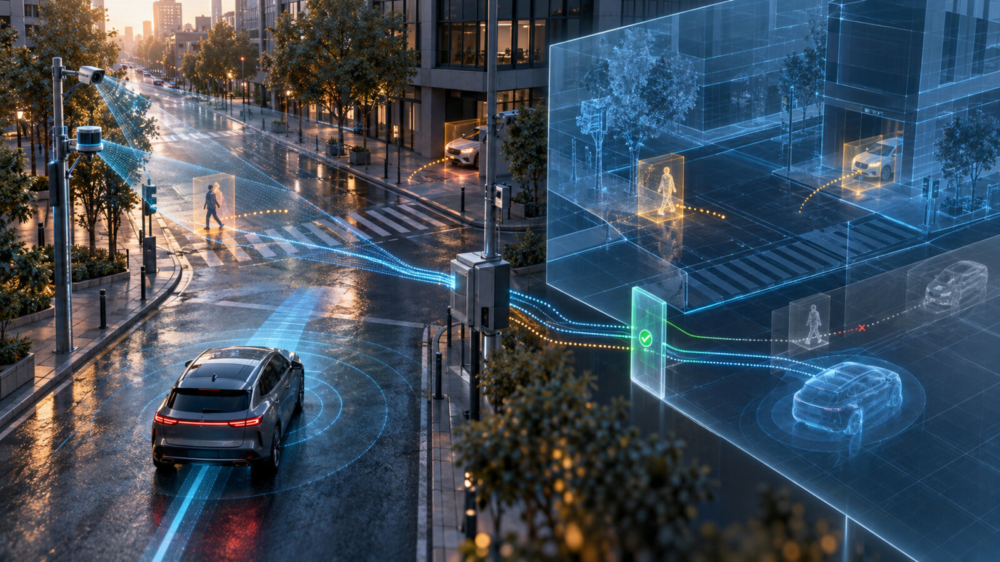

# Shadow-Mode Digital Twins for V2X Cooperative Perception

Author: concierge@massivequbit.io

Cooperative perception allows vehicles and roadside stations to share detected objects over vehicle-to-everything (V2X) communications. It can reveal a road user hidden by an obstruction, but when should a receiver trust a remote track? This article proposes a shadow-mode digital twin that tests shared objects against local sensors, map constraints, timing, and network conditions before they influence driver assistance. The twin is a validation instrument, not an autonomous-driving claim.

## The problem is not message delivery alone

A cooperative-perception message can contain an object's position, motion, dimensions, classification, age, and associated sensor information. ETSI TS 103 324 defines the Collective Perception Service and an interoperable message structure for sharing perceived objects and perception regions [3]. Successful decoding, however, does not prove that the reported object is current, correctly localized, or safe to fuse.

Clock offset can move an accurate track along its predicted path. Poor calibration can rotate or translate roadside detections. Congestion control can delay updates. Two stations may assign different identifiers to one road user, while a faulty station may generate plausible but incorrect objects.

Peer-reviewed work by Thandavarayan, Sepulcre, and Gozalvez showed that message-generation rules affect channel utilization and perception performance [1]. A second study by the same authors found that cooperative perception can extend awareness, while unsuitable congestion-control settings can increase information age and reduce effectiveness [2]. These studies support cooperative perception's technical potential, but they also show why message receipt should not be treated as evidence of operational validity.

## A twin that observes before it acts

The proposed twin runs beside the vehicle or road operator's live perception stack. It consumes the same timestamped inputs but cannot directly command steering, braking, or acceleration during the pilot. Its outputs are comparisons, confidence changes, and auditable acceptance decisions.

A minimum architecture has six stages:

1. **Roadside and vehicle sensing.** Cameras, radar, lidar, and vehicle-state sensors create local tracks with versioned calibration, field of view, uncertainty, and health status.
2. **V2X ingestion.** An ITS station receives and verifies Collective Perception Messages (CPMs), decodes the standardized data elements, preserves the sender's stated quality fields, and records reception time.
3. **Spatial-temporal normalization.** Remote tracks enter a common map frame; impossible timestamps or transforms are rejected.
4. **Shadow digital twin.** A local dynamic scene maintains road geometry, occlusion zones, sensor coverage, physical actors, and alternative track hypotheses. It predicts each object's short-horizon motion without changing the operational controller.
5. **Independent trust gate.** Rules compare remote and local evidence, source health, track continuity, map plausibility, and uncertainty. A remote object can be corroborated, useful-but-unconfirmed, contradictory, stale, or invalid.
6. **Evidence and replay.** Bounded event windows preserve configurations and decisions without retaining unrestricted continuous video.

The standard supplies interoperable information, not a complete trust policy. ETSI explicitly includes security interfaces, permissions, quality fields, and data-age concepts in the service architecture [3]. Implementers still need to decide what evidence is sufficient for a specific application and operational design domain.

## Validation logic that exposes disagreement

The twin should preserve uncertainty rather than collapse every input into one authoritative track. For a remote observation with timestamp `t_m`, received at `t_r`, a simple age measure is `age = t_r - t_m`. The twin propagates position using the reported motion model while increasing uncertainty with time. It then asks four practical questions:

- Does the predicted location remain on a feasible road, footpath, crossing, or adjacent area?
- Is the object inside the claimed sensor's field of view and range?
- Does local radar, lidar, camera, or another independent station provide compatible evidence?
- Would accepting the object create a track jump, duplicate, or physically implausible trajectory?

Thresholds must be application-specific. A cautious advisory can use weaker evidence than an automated manoeuvre. Sender confidence must never translate directly into actuator authority.

Recent work also sharpens the research question. A 2026 preprint by Mohammadisarab and colleagues reports that fusing onboard and V2X data can introduce false-positive or “ghost” objects even when shared data is accurate [4]. This is not counted as peer-reviewed evidence, and its claims should be treated as provisional. It nevertheless provides a useful test hypothesis: more cooperative data is not automatically safer unless association and fusion behaviour are validated.

## Hypothetical intersection pilot

Consider a hypothetical signalized intersection with one building that blocks a driver's view of pedestrians and cross traffic. Install two roadside sensing stations with overlapping coverage. Each station produces local tracks and CPMs; one instrumented vehicle receives them. The vehicle's existing safety functions remain unchanged.

Phase one records synchronized sensor, CPM, network, and map data while engineers verify frames, clocks, fields of view, object age, packet loss, and continuity. Phase two replays an occluded pedestrian, an approaching bicycle, a stopping vehicle, and an empty intersection against independently calibrated ground truth.

Phase three runs the twin live in shadow mode. It compares what the operational vehicle perceived with what it would have accepted from V2X. Acceptance criteria should include remote-track precision and recall, duplicate-track rate, false-positive duration, localization error, message age, time-to-first-useful-detection, channel load, and the percentage of events reproducible from stored evidence. Safety-relevant results must be reported by scenario and operating condition, not only as an aggregate average.

Only after the shadow system meets predefined criteria should remote tracks enter a driver-information display. Progression to warning or control functions requires a separate safety case, hazard analysis, regulatory assessment, and vehicle-level validation.

## Hardware, software, skills, and indicative cost

Hardware may include roadside radar and cameras or lidar, an edge GPU or industrial computer, a V2X roadside unit, accurate time synchronization, secure networking, an onboard V2X unit, and a development data logger. Software needs CPM encoding and decoding, certificate and permission checks, time and coordinate services, a local dynamic map, multi-object tracking, simulation and replay, metrics, configuration control, and tamper-evident audit logs.

Required skills include calibration, tracking, V2X networking, embedded systems, functional safety, cybersecurity, privacy engineering, traffic operations, and test design. Inaccurate ground truth can hide systematic errors.

The following estimate is hypothetical, not a sourced market price. Assume two roadside sensing and communications stations at AUD 18,000 each, AUD 12,000 for an onboard development kit and logger, and AUD 8,000 for edge compute, timing, networking, and installation. Hardware is therefore `2 × 18,000 + 12,000 + 8,000 = AUD 56,000`. At an illustrative loaded engineering rate of AUD 1,600 per day, 35 days for integration, calibration, scenarios, and analysis adds `35 × 1,600 = AUD 56,000`, producing an indicative pilot total of AUD 112,000. Civil works, traffic management, spectrum arrangements, vehicle integration, certification, and longer trials can increase the cost substantially.

## Cybersecurity, privacy, and operational trade-offs

Signed V2X messages establish provenance and integrity within a credential system; they do not prove that a sensor measured reality correctly. The trust gate should therefore combine credential status with consistency checks, rate limits, source diversity, sensor health, and misbehaviour handling. Protect calibration and map updates, isolate development interfaces, disable default credentials, maintain signed software and rollback paths, and record configuration hashes for every test.

Roadside perception can capture faces, number plates, and trajectories. Prefer object data over raw imagery outside controlled evidence windows. Define retention, access, redaction, and deletion before collection, and prevent event data from becoming a general-purpose tracking system.

The key operational trade-off is sensitivity versus false alarms. Aggressive acceptance may reveal hazards earlier but import more uncertainty; conservative acceptance may miss the benefit of cooperation. Higher message frequency improves freshness but consumes channel capacity. More retained evidence improves diagnosis but increases privacy and security exposure. The twin makes these trade-offs measurable rather than eliminating them.

## Actionable conclusion

Start with one occluded intersection and one decision: whether a shared object is credible enough to inform a human-facing advisory. Implement ETSI-compatible messaging, explicit time and coordinate handling, independent validation rules, and reproducible replay. Measure object usefulness, age, contradictions, and false positives before discussing automated control.

A cooperative-perception digital twin is valuable when it can explain why remote evidence was accepted or rejected under a known configuration. Shadow mode provides a credible bridge from standards-compliant message exchange to operational trust—without confusing connectivity with safety.

## References

1. Thandavarayan, G., Sepulcre, M., and Gozalvez, J. (2020). “Generation of Cooperative Perception Messages for Connected and Automated Vehicles.” *IEEE Transactions on Vehicular Technology*, 69(12), 16336–16341. https://doi.org/10.1109/TVT.2020.3036165. Peer-reviewed journal article; full text reviewed from the Universidad Miguel Hernández institutional repository.
2. Thandavarayan, G., Sepulcre, M., and Gozalvez, J. (2020). “Cooperative Perception for Connected and Automated Vehicles: Evaluation and Impact of Congestion Control.” *IEEE Access*, 8, 197665–197683. https://doi.org/10.1109/ACCESS.2020.3035119. Peer-reviewed open-access journal article; full text reviewed under CC BY 4.0.
3. European Telecommunications Standards Institute. (2023). *ETSI TS 103 324 V2.1.1: Intelligent Transport System (ITS); Vehicular Communications; Basic Set of Applications; Collective Perception Service; Release 2*. https://www.etsi.org/deliver/etsi_ts/103300_103399/103324/02.01.01_60/ts_103324v020101p.pdf. Official technical specification; full text reviewed. No text, tables, or figures reproduced.
4. Mohammadisarab, A., Sepulcre, M., Lusvarghi, L., Avedisov, S. S., Khan, M. I., Shimizu, T., Altintas, O., and Gozalvez, J. (2026). “Fusion or Confusion? Potential and Challenges in Fusion of Onboard Sensors and V2X Data in Cooperative Perception.” *arXiv preprint* arXiv:2607.05889. https://arxiv.org/abs/2607.05889. Preprint; not counted toward the peer-reviewed-source requirement; abstract reviewed.
